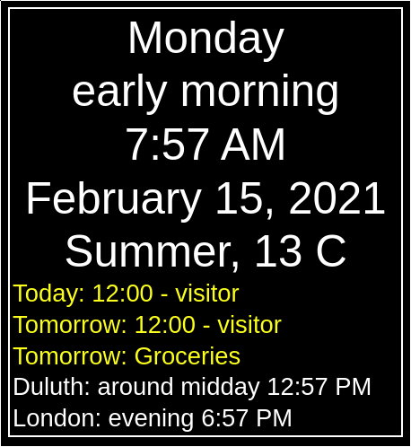

# It Is Now

Web page that acts as a descriptive clock for people that need a little
help keeping track of time.  Includes descriptions of time in other time-zones.
Can list repeating events (by day of week only) and dated events.

[View demo](https://tbnorth.github.io/itisnow/)

Fork and customize to make one that suits your situation.

